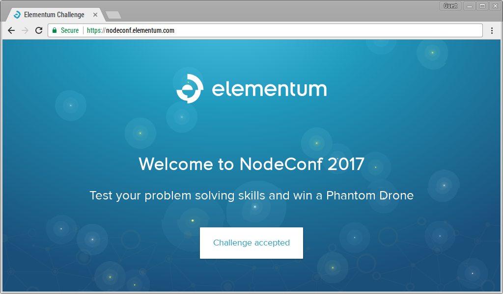
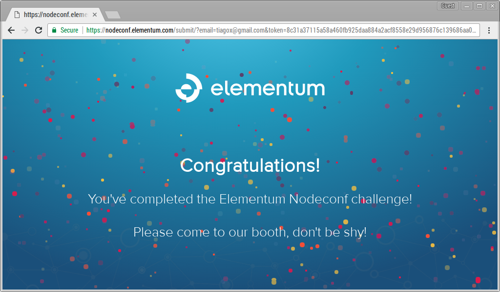

# Elementum Challenge Solution

During the NodeConfAR 2017, Elementum throw a challenge. If you'd solved it, you'd be participating on a raffle for a drone. To start you have to go to: [https://nodeconf.elementum.com/](https://nodeconf.elementum.com/)

If you accepted the challenge, you'd get an email with instructions that you have to follow. If you're persistent enough, you'd get here:

For the time you're reading this is probable that Elementum already took down the server to play with the challenge, but you can follow the different code steps I had to follow to complete the challenge:

* [Step 1](step-1.js)
* [Step 2](step-2.js)
* [Step 3](step-3.js)
* [Step 4](step-4.js)
* [Step 5](step-5.js)
